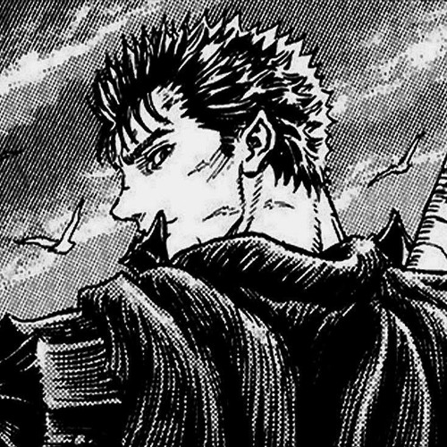

# Salut! 👋 | Hello!

## 🖼️ Avatar

## 📝 Despre mine

Sunt un developer din Moldova, cu accent pe dezvoltarea web de comerț electronic. Cu experiență în dezvoltarea temelor Shopify și optimizarea web, îmi place să creez soluții digitale eficiente și ușor de utilizat. Întotdeauna dornic să învǎț noi tehnologii și să fiu la curent cu tendințele din industrie.

În prezent îmi construiesc cariera în dezvoltarea web, în ​​timp ce explorez intersecția interesantă dintre tehnologie, design și afaceri online.

## 🎯 Domenii de interes

- Gaming
- Manga
- E-commerce
- Marketing
- Design

## 💻 Limbaje de programare

### Cunosc

- JavaScript
- TypeScript
- CSS

### În curs de învățare

- Liquid

### Doresc să învăț

- E-commerce mai aprofundat,
- Email Marketing
- SEO Optimizatie

## 📫 Contact

- Email: maximmadan3@gmail.com
- LinkedIn: https://www.linkedin.com/in/maxim-madan/
- GitHub: [github.com/ecmasx](https://github.com/ecmasx)

---

_Ultima actualizare | Last update: [current_date]_
